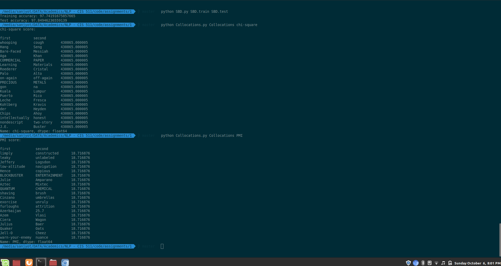

# Sentence boundary detection and identifying language collocations

## Sentence boundary detection

Implement a sentence boundary detector using a decision tree classifier.

### Usage
`$ python SBD.py SBD.train SBD.test`

Program should produce test accuracy on standard output. It should also generate `SBD.test.out` containing output predictions.

## Collocation identifier

Implement a collocation identifier for bigrams using chi-square and pointwise mutual information criterias.

### Usage
`$ python Collocations.py Collocations <measure>`

where `<measure>` could be either `chi-square` of `PMI`.

Program should produce top 20 bigrams with their scores on the standard output.

## Output

## Dependencies
Make sure you have
- Numpy
- Pandas

